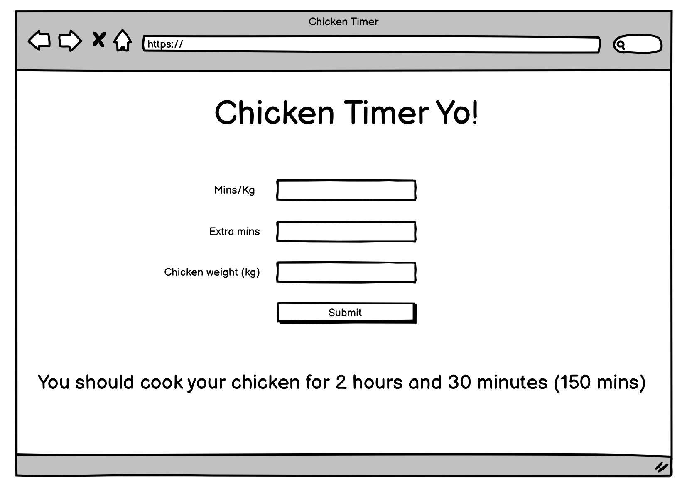

## The Chicken Timer

Jelena always seems to have difficulty calculating how long a chicken needs to cook. Your mission, should you wish to accept it, is to create a web application so that Jelena can easily caclulate how long to put the poultry in the oven for so that it is perfectly cooked.

A purchased chicken normally comes with instructions indicating how many minutes it needs to be cooked per kilo of weight. On top of this, there is a standard amount of time to be added on top of the calculated time.

The instructions would be something like this:

> Cook the chicken for 35 minutes per kilo plus a further 20 minutes

This web application will be make up of 3 files.

- A html file, to contain the inputs to gather the following information: minutes per kilo, standard extra minutes, weight of the chicken. The html file should also contain a button to submit the entered values
- A css file, to position the inputs and give some nice styling.
- A js file, to do the calculation, once the html button has been pressed

Once you have created the application, you should deploy it to github pages so that Jelena can access it.

An example of how this might look is shown below, obviously you can make it look a lot prettier than this:

Once the button is pressed, you should display how long the chicken should be cooked for:

